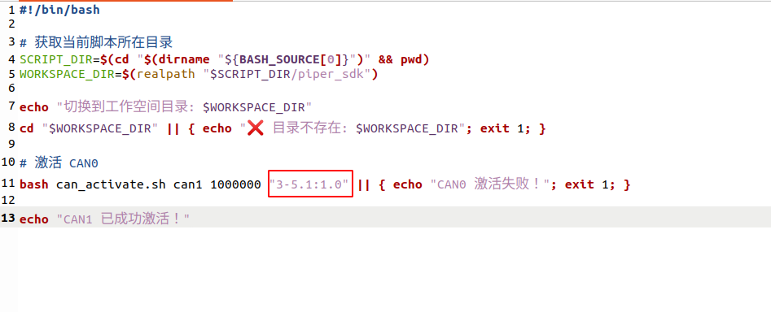
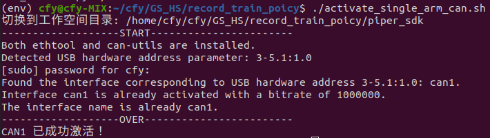
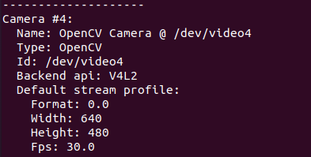
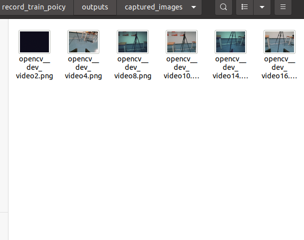
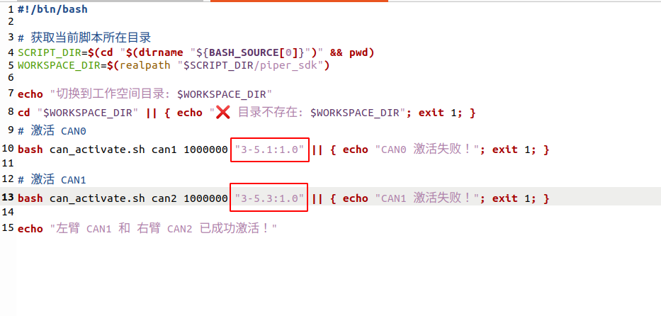
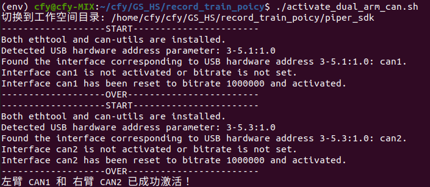
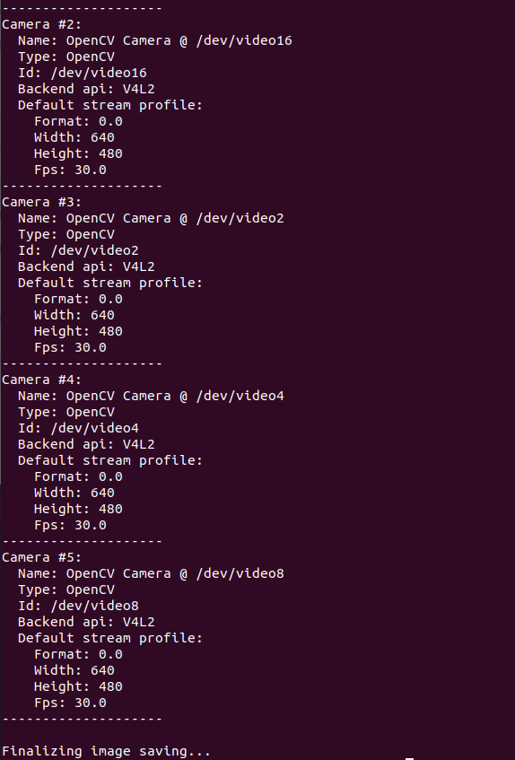
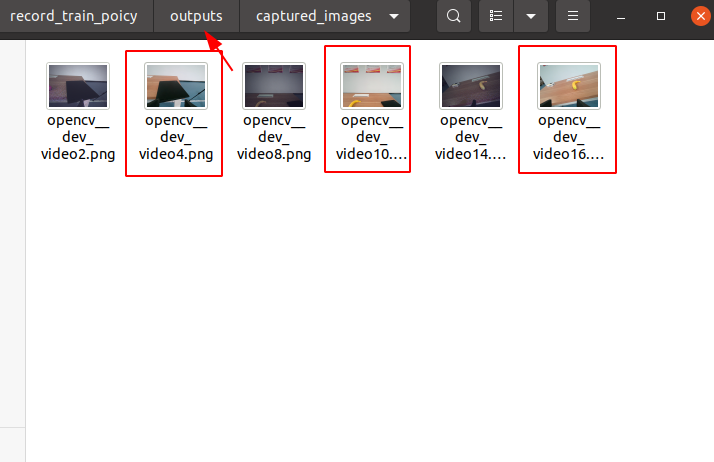
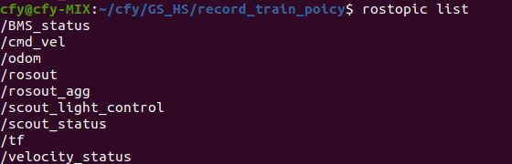

#  单臂 / 双臂 / Mobile AI 数据采集、训练与验证流程

本项目支持移动平台（Mobile AI）、双臂（dual_piper）、单臂（single_piper）三种机器人形态的数据采集、训练和推理。

> # ⚠️ **Warning**
>
> ## 采集数据阶段请连接主从臂 !
>
> ## 推理阶段请断开主从臂, 只保留从臂 !

---

## ✅ 安装
### 1. 拉取项目代码
```bash
$ git clone https://github.com/mlpchenxl/record_train_poicy.git
$ cd record_train_poicy
```
### 2. 创建虚拟环境并安装依赖
### 1. 拉取项目代码
```bash
$ conda create -n env python=3.10.9
$ conda activate env
$ pip install -r requirements.txt
```
---

## ✅ 数据采集

### 单臂数据采集

#### 1. 启动单臂通信
##### (1) 连接机械臂 usb
> ⚠️ **Note: 第一次连接机械臂前请务必检查 CAN 口配置**

在第一次连接机械臂时，请执行以下步骤查找并配置对应的 **CAN 口**：

*在终端中执行以下命令：

```bash
sudo ethtool -i can0 | grep bus
```
并记录下 bus-info 的数值，例如 3-5.1:1.0; 如果未识别出 can0 , 执行以下脚本查看所有连接的 CAN 模块及其对应的 USB 地址
```bash
$ cd ${项目路径}
$ conda activate env
$ bash piper_sdk/find_all_can_port.sh
```
将 bus-info 的数值填写到 ${项目路径}/activate_single_arm_can.sh 中, 如下图所示

配置完成后，只要不更换连接的 USB 端口，后续重复连接机械臂时无需再次更改该脚本
##### (2) 激活机械臂 can 口通信
```bash
$ cd ${项目路径}
$ conda activate env
$ ./activate_single_arm_can.sh # 会将机械臂 can 口映射为 can1
```
> ⚠️ **Note**
> 
> 执行完 ./activate_single_arm_can.sh 后会出现如下 can 口激活成功打印，若失败, 重新插拔 usb 或机械臂重新上电, 再尝试连接

#### 2. 查找相机编号
##### (1) 将相机通过 usb 口与主机相连
##### (2) 查找相机编号
```bash
$ cd ${项目路径}
$ PYTHONPATH=. python lerobot/find_cameras.py opencv
```

终端会出现所有识别到的 camera 编号, 如下图所示



同时 record_train_poicy 路径下会出现一个 outputs 文件夹，该文件夹下会产生一个名为 captured_images 的文件夹，存放所有识别到的相机拍摄的单张图，如下图所示



记住所需要使用相机的编号，编号为 video 后的数字 (如 video4, 则该相机对应的编号是4)

#### 4. 记录数据
```bash
$ cd ${项目路径}
# 通过步骤 3 查找到的相机编号，依次修改所需要使用的相机 index_or_path
# dataset.repo_id     : 可根据自己 huggingface 账号命名 (随意命名也可)
# dataset.num_episodes： 记录多少条数据
# dataset.root        : 数据存放地址
# dataset.single_task : 任务名称
# display_data        : 是否在录数据过程中可视化记录数据
$ python -m lerobot.record \
--robot.type=single_piper \
--robot.port=" " \
--robot.id=single_piper_robot \
--robot.cameras="{wrist: {type: opencv, index_or_path: 4, width: 640, height: 480, fps: 30}}" \
--dataset.repo_id=cfy/sigle_piper \
--dataset.root=/home/cfy/cfy/GS_HS/record_train_poicy/data/single_vla_test \
--dataset.num_episodes=20 \
--dataset.single_task="Grab the cube" \
--display_data=True
```
> ⚠️ **Note**
> 
> 通过键盘上的方向键（← →）、 esc 键控制记录数据
>
> →   : 当前数据记录结束, 开启下一段数据记录
>
> ←   : 不想保存当前数据
>
> esc : 提前终止数据记录

### 双臂数据采集

#### 1. 启动双臂 can 口通信
##### (1) 连接机械臂 usb
> ⚠️ **Note: 第一次连接机械臂前请务必检查 CAN 口配置**

在第一次连接机械臂时，请执行以下步骤查找并配置对应的 **CAN 口**：

*在终端中执行以下命令：
注：一般第一个插入的can模块会默认是can0, 先插入左臂连接的 usb, 再插入右臂连接的 usb (此时左臂对应 can0, 右臂对应 can1), 执行
```bash
sudo ethtool -i can0 | grep bus
```
并记录下左臂 bus-info 的数值，例如 3-5.1:1.0; 再查询 can 1 的 bus-info
```bash
sudo ethtool -i can1 | grep bus
```
记录下右臂 bus-info 的数值，例如 3-5.3:1.0. 如果未识别出 can , 执行以下脚本查看所有连接的 CAN 模块及其对应的 USB 地址
```bash
$ cd ${项目路径}
$ conda activate env
$ bash piper_sdk/find_all_can_port.sh
```
将左右臂的 bus-info 的数值填写到 ${项目路径}/activate_dual_arm_can.sh 中, 如下图所示

配置完成后，只要不更换连接的 USB 端口，后续重复连接机械臂时无需再次更改该脚本
##### (2) 激活机械臂 can 口通信

```bash
$ cd ${项目路径}
$ conda activate env
$ ./activate_dual_arm_can.sh # 会将左机械臂 can 口映射为 can1, 右机械臂 can 口 映射为 can 2
```
> ⚠️ **Warning**
> 
> 执行完 ./activate_dual_arm_can.sh 后会出现如下 can 口激活成功打印，若失败, 重新插拔 usb 或机械臂重新上电, 再尝试连接


#### 2. 查找相机编号
##### (1) 将相机通过 usb 口与主机相连
##### (2) 查找相机编号

```bash
$ cd ${项目路径}
$ PYTHONPATH=. python lerobot/find_cameras.py opencv
```

> ⚠️ **Note**
> 
> 执行完 PYTHONPATH=. python lerobot/find_cameras.py opencv 终端后会出现如下识别到的相机编号与其他信息打印


> 同时, 项目文件夹下会出生成一个 output/captured_images, 保存识别到的相机所捕获的一张照片, 如下所示, 记住所需要使用相机的编号，编号为 video 后的数字 (如 需要使用相机video4, video10, video16， 则该相机对应的编号是4, 10, 16)


#### 4. 记录数据
```bash
$ cd ${项目路径}
# 通过步骤 3 查找到的相机编号，依次修改所需要使用的相机 index_or_path, 编号对应自定义的相机名称, 如 4 号相机是左腕部相机
# robot.type          : 机器人类型 (single_piper/dual_piper/moving_dual_piper)
# dataset.repo_id     : 可根据自己 huggingface 账号命名 (随意命名也可)
# dataset.num_episodes： 记录多少条数据
# dataset.root        : 数据保存地址
# dataset.single_task : 任务名称
# display_data        : 是否在录数据过程中可视化记录数据
$ PYTHONPATH=. python -m lerobot.record  \ 
--robot.type=moving_dual_piper   \
--robot.port=" "   \
--robot.id=mobile_ai_robot   \
--robot.cameras="{wrist_left: {type: opencv, index_or_path: 4, width: 640, height: 480, fps: 30}, top: {type: opencv, index_or_path: 10, width: 640, height: 480, fps: 30}, wrist_right: {type: opencv, index_or_path: 16, width: 640, height: 480, fps: 30}}"   \
--dataset.repo_id=kelo/vla_test \
--dataset.root=/home/cfy/cfy/GS_HS/record_train_poicy/data/vla_test \ --dataset.num_episodes=1   \
--dataset.single_task="Grab the cube" \
--display_data=True
```
> ⚠️ **Note**
> 
> 通过键盘上的方向键（← →）、 esc 键控制记录数据
>
> →   : 当前数据记录结束, 开启下一段数据记录
>
> ←   : 不想保存当前数据
>
> esc : 提前终止数据记录

### Mobile AI 数据采集

#### 1. 启动底盘通信（CAN）

##### (1)注意事项
---

> ⚠️ **Warning**
> 
> 启动底盘通信前，请 **务必先断开机械臂的 USB 连接**, 否则可能导致通信冲突或设备识别错误，影响正常运行。

> 第一次拉取代码, 需要先编译 scout_mini_ros 与 ugv_sdk
```bash
$ cd ${项目路径}/scout_mini_ws
$ catkin_make
```

##### (2) 启动底盘通信
```bash
$ cd ${项目路径}
$ ./start_car_usb.sh
```
> ⚠️ **Note**

> 执行完 ./start_car_usb.sh， 用 rostopic list 查看是否有以下topic



> 启动后该终端需要持续保持运行，**不要中途关闭**
#### 2. 启动双臂 can 口通信
##### (1) 连接机械臂 usb
> ⚠️ **Note: 第一次连接机械臂前请务必检查 CAN 口配置**

在第一次连接机械臂时，请执行以下步骤查找并配置对应的 **CAN 口**：

*在终端中执行以下命令：
注：一般第一个插入的can模块会默认是can0, 之前已经连接了底盘的 can 模块，先插入左臂连接的 usb, 再插入右臂连接的 usb (此时左臂对应 can1, 右臂对应 can2), 执行
```bash
sudo ethtool -i can1 | grep bus
```
并记录下左臂 bus-info 的数值，例如 3-5.1:1.0; 再查询 can 2 的 bus-info
```bash
sudo ethtool -i can2 | grep bus
```
记录下右臂 bus-info 的数值，例如 3-5.3:1.0. 如果未识别出 can , 执行以下脚本查看所有连接的 CAN 模块及其对应的 USB 地址
```bash
$ cd ${项目路径}
$ conda activate env
$ bash piper_sdk/find_all_can_port.sh
```
将左右臂的 bus-info 的数值填写到 ${项目路径}/activate_dual_arm_can.sh 中, 如下图所示

配置完成后，只要不更换连接的 USB 端口，后续重复连接机械臂时无需再次更改该脚本
##### (2) 激活机械臂 can 口通信
打开一个新的终端
> ⚠️ **Note**
> 
> 执行完 ./activate_dual_arm_can.sh 后会出现如下 can 口激活成功打印，若失败, 重新插拔 usb 或机械臂重新上电, 再尝试连接

```bash
$ cd ${项目路径}
$ conda activate env
$ ./activate_dual_arm_can.sh # 会将左机械臂 can 口映射为 can1, 右机械臂 can 口 映射为 can 2
```
#### 3. 查找相机编号
##### (1) 将相机通过 usb 口与主机相连
##### (2) 查找相机编号

```bash
$ cd ${项目路径}
$ PYTHONPATH=. python lerobot/find_cameras.py opencv
```

> ⚠️ **Note**
> 
> 执行完 PYTHONPATH=. python lerobot/find_cameras.py opencv 终端后会出现如下识别到的相机编号与其他信息打印


> 同时, 项目文件夹下会出生成一个 output/captured_images, 保存识别到的相机所捕获的一张照片, 如下所示, 记住所需要使用相机的编号，编号为 video 后的数字 (如 需要使用相机video4, video10, video16， 则该相机对应的编号是4, 10, 16)


#### 4. 记录数据
```bash
$ cd ${项目路径}
# 通过步骤 3 查找到的相机编号，依次修改所需要使用的相机 index_or_path, 编号对应自定义的相机名称, 如 4 号相机是左腕部相机
# robot.type          : 机器人类型 (single_piper/dual_piper/moving_dual_piper)
# dataset.repo_id     : 可根据自己 huggingface 账号命名 (随意命名也可)
# dataset.num_episodes： 记录多少条数据
# dataset.root        : 数据保存地址
# dataset.single_task : 任务名称
# display_data        : 是否在录数据过程中可视化记录数据
$ PYTHONPATH=. python -m lerobot.record  \ 
--robot.type=moving_dual_piper   \
--robot.port=" "   \
--robot.id=mobile_ai_robot   \
--robot.cameras="{wrist_left: {type: opencv, index_or_path: 4, width: 640, height: 480, fps: 30}, top: {type: opencv, index_or_path: 10, width: 640, height: 480, fps: 30}, wrist_right: {type: opencv, index_or_path: 16, width: 640, height: 480, fps: 30}}"   \
--dataset.repo_id=kelo/vla_test \
--dataset.root=/home/cfy/cfy/GS_HS/record_train_poicy/data/vla_test \ --dataset.num_episodes=1   \
--dataset.single_task="Grab the cube" \
--display_data=True
```
> ⚠️ **Note**
> 
> 通过键盘上的方向键（← →）、 esc 键控制记录数据
>
> →   : 当前数据记录结束, 开启下一段数据记录
>
> ←   : 不想保存当前数据
>
> esc : 提前终止数据记录

---
## ✅ 训练
```bash
$ cd ${项目路径}
$ conda activate env

### 参数说明
# policy.type          : 策略 (如 act、 diffusion\ smolvla)
# dataset.repo_id      : 可根据自己 huggingface 账号命名 (随意命名也可)
# batch_size           : batch_size 大小
# steps                : 轮次
# output_dir           : 权重保存地址
# dataset.root         : 数据集存放地址

### smolvla
$ PYTHONPATH=. python lerobot/scripts/train.py \
--policy.type=smolvla \
--dataset.repo_id=cfy/vla_test \
--batch_size=4 \
--steps=200000 \
--output_dir=/home/cfy/cfy/cfy/lerobot_nn/GS-HS/record_train_poicy/single_piper_env/ckpt/smolvla_ckpt \
--dataset.root=/home/cfy/cfy/cfy/lerobot_nn/GS-HS/record_train_poicy/single_piper_env/dataset/single_vla_test

### act
$ PYTHONPATH=. python lerobot/scripts/train.py \
--policy.type=smolvla \
--dataset.repo_id=cfy/vla_test \
--batch_size=4 \
--steps=200000 \
--output_dir=/home/cfy/cfy/cfy/lerobot_nn/GS-HS/record_train_poicy/single_piper_env/ckpt/act_ckpt \
--dataset.root=/home/cfy/cfy/cfy/lerobot_nn/GS-HS/record_train_poicy/single_piper_env/dataset/single_vla_test

### diffusion
$ PYTHONPATH=. python lerobot/scripts/train.py \
--policy.type=diffusion \
--dataset.repo_id=cfy/vla_test \
--batch_size=4 \
--steps=200000 \
--output_dir=/home/cfy/cfy/cfy/lerobot_nn/GS-HS/record_train_poicy/single_piper_env/ckpt/diffusion_ckpt \
--dataset.root=/home/cfy/cfy/cfy/lerobot_nn/GS-HS/record_train_poicy/single_piper_env/dataset/single_vla_test
```

---
## ✅ 验证步骤
### 启动 can 口通信 (同上记录数据过程, 自行选择三种机器人形态 can 激活方式)

### 机械臂使能至初始位置
```bash
$ cd ${项目路径}
$ conda activate env
```
自行选择单臂还是双臂
#### (1) (optional) 单臂使能
```bash
$ python piper_sdk/demo/V1/piper_joint_ctrl.py
```

#### (2) (optional) 双臂使能
```bash
$ python piper_sdk/demo/V1/piper_bimanual_joint_ctrl.py
```
> ⚠️ **Warning**
>
> 机械臂到达初始位置请关闭该程序, 否则会持续向机械臂发送初始位置, 导致 policy 验证失败

### 测试训练权重
```bash
### smolvla
# robot.type           : 机器人类型 (single_piper/dual_piper/moving_dual_piper)
# policy.type          : 策略 (如 act/diffusion/smolvla)
# ckpt_path            : 权重保存地址
$ python -m lerobot.inference \
--robot.type=single_piper \
--robot.port=" " \
--robot.id=single_piper_robot \
--robot.cameras="{wrist: {type: opencv, index_or_path: 16, width: 640, height: 480, fps: 30}}" \
--policy.type=smolvla \
--ckpt_path=/home/cfy/cfy/GS_HS/record_train_poicy/ckpt/smolvla_ckpt/checkpoints/020000/pretrained_model

### act
# robot.type           : 机器人类型 (single_piper/dual_piper/moving_dual_piper)
# policy.type          : 策略 (如 act/diffusion/smolvla)
# ckpt_path            : 权重保存地址
$ python -m lerobot.inference \
--robot.type=single_piper \
--robot.port=" " \
--robot.id=single_piper_robot \
--robot.cameras="{wrist: {type: opencv, index_or_path: 16, width: 640, height: 480, fps: 30}}" \
--policy.type=act \
--ckpt_path=/home/cfy/cfy/GS_HS/record_train_poicy/ckpt/act_ckpt/checkpoints/020000/pretrained_model

### diffusion
# robot.type           : 机器人类型 (single_piper/dual_piper/moving_dual_piper)
# policy.type          : 策略 (如 act/diffusion/smolvla)
# ckpt_path            : 权重保存地址
$ python -m lerobot.inference \
--robot.type=single_piper \
--robot.port=" " \
--robot.id=single_piper_robot \
--robot.cameras="{wrist: {type: opencv, index_or_path: 16, width: 640, height: 480, fps: 30}}" \
--policy.type=diffusion \
--ckpt_path=/home/cfy/cfy/GS_HS/record_train_poicy/ckpt/diffusion_ckpt/checkpoints/020000/pretrained_model
```

> ⚠️ **Warning**
>
> 机器人类型与策略类型必须与训练数据保持一致